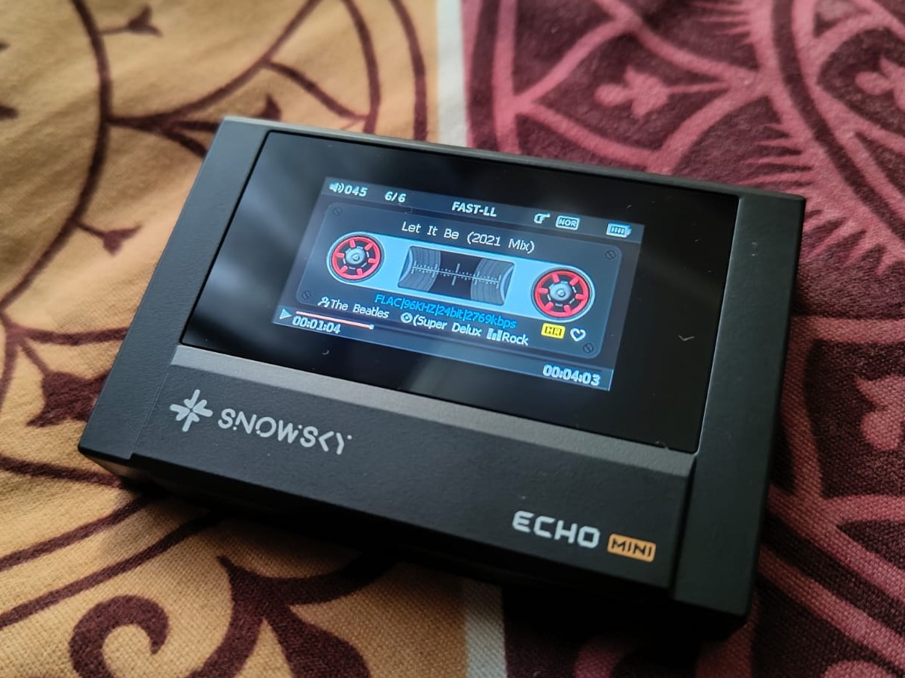

# FLAC Block Size Converter

A simple script to re-encode FLAC files with a block size of 4608 while preserving metadata and album artwork for improved compatibility with the *FiiO SNOWSKY ECHO Mini* and other high-resolution digital audio players.





### Features

- Batch processes every ".flac" file in the current folder
- Converts FLAC block size to 4608
- Preserves all FLAC tags (artist, album, track number, etc.)
- Preserves embedded cover art
- Resizes cover art to a maximum of 640×640 (only if larger)
- Outputs converted files to a separate "converted" folder

### Requirements

- [FLAC](https://github.com/xiph/flac)
- [ImageMagick](https://github.com/imagemagick/imagemagick)

---

# How To Use FLAC Block Size Converter

### Download the project

Clone the repository or download it as a ZIP and extract it.
```bash
git clone https://github.com/praveenprasannan97/FLAC-Block-Size-Converter.git
```

## For Windows

### Install FLAC

Open PowerShell or Command Prompt as Administrator and run:
```bash
winget install Xiph.FLAC
```

### Install ImageMagick

Install ImageMagick using Winget:
```bash
winget install ImageMagick.ImageMagick
```
### Copy your FLAC files

Place the ".bat" script in the folder containing the FLAC files you want to convert.

Example:
```
Music
│
├── Audio1.flac
├── Audio2.flac
├── Audio3.flac
└── FLAC_Blocksize_Converter.bat
```

### Run the converter

***Simply double-click:***

flac_block_size_converter.bat

or ***open Command Prompt in the folder and run:***
```bash
flac_block_size_converter.bat
```
The script will automatically process every ".flac" file in the current directory.

### Output

Converted files are written to:

converted\

Temporary working files are stored in:

temp\

The original FLAC files are never modified.

---

# How The Script works

For every FLAC file:

1. Exports all metadata
2. Extracts embedded cover artwork
3. Displays the original block size
4. Decodes the FLAC to WAV
5. Re-encodes using block size 4608
6. Restores all metadata
7. Resizes artwork to a maximum of 640×640
8. Embeds the resized artwork
9. Saves the finished file into the "converted" folder

---

### Example Console Output
```
=====================================
FLAC Block Size Converter
Converts block size to 4608
Preserves tags
Resizes cover art to max 640x640
=====================================

Processing FLAC files...

=====================================

Processing: Audio.flac

Block Size     : 8192 > 4608

audio.wav: wrote 89526800 bytes, ratio=0.623
Original Cover: 1400x1400
Output Cover  : 640x640
Finished: Audio.flac

=====================================

All files completed.
Output folder: converted

=====================================

Press any key to continue . . .
```
---

## License

This project is released under the AGPL-3.0 License. Feel free to modify and distribute it.